Project available at http://srv22.mikr.us:20289/

login: root@email.com

password: pass

Project in testing process, deployment may not work properly.

## Contents

* [About The Project](#about-the-project)
* [Built with](#built-with)
* [Getting Started](#getting-started)
* [Exploring AutoCare](#exploring-autocare)
* [Design Patterns](#design-patterns)
* [Roadmap](#roadmap)
* [Contact](#Contact)
* [License](#license)

## About the project

This project was created to support meneger of workshop to keep the track about actual stock of workshop items.

The application allows you to create a database of users, workshop items, stock of workshop items in the store, orders and their management over time.

Selected functionalities:

* ability to log in as admin or normal user
* possibility of use by many workshops at the same time
* management of available workshop items and employees
* adding products to the cart
* update store stock
* updating the stock of workshop items on
* employee management

## Built with

* Java 21
* Apache Maven
* MySQL
* Hibernate
* H2
* Lombok
* Spring Web
* Spring Data
* Spring Security
* Spring MVC
* Git
* Docker
* VPS

## Getting Started

#### With Maven:

To get a local copy up and running follow these simple steps.

1. Clone the repository
   ```sh
   git clone https://github.com/LittleYodaa/servicesupply.git
   ```
2. Build project with maven
   ```sh
   mvn spring-boot:run
   ```
or by this url: http://srv22.mikr.us:20289/

## Exploring servicesupply

Operation and available endpoints

### Product details

| Method | Url            | Description                                                                                        |                                                                                                                                                                                         |
|--------|----------------|----------------------------------------------------------------------------------------------------|-----------------------------------------------------------------------------------------------------------------------------------------------------------------------------------------------------------------------|
| GET    | /productDetails | Get all available products.                                                                                 |                                                                                                                                                                                                                       |
| GET   | /productDetails/showNewProductForm    | Show new form to add new product.                                                                                  |  |
| GET    | /productDetails/{id}showFormForUpdate | Show form to update product details with pre-filled fields. |                |
                                    |                                                                                                                                                                                                                       |

### Cart products

| Method | Url                                                  | Description                                                                                                              |                                                                                                                                                                                                                    |
|--------|------------------------------------------------------|--------------------------------------------------------------------------------------------------------------------------|--------------------------------------------------------------------------------------------------------------------------------------------------------------------------------------------------------------------------------------------------|
| GET    | /cartProducts                            | Get all user cart products.                                |                                                                                                                                                                                                                                                  |
| GET    | /cartProducts/{id}/addCartProduct                        | Add new product to users cart.                                                                                            |                                                                                                            |
| GET   | /cartProducts/{id}/deleteCartProduct                                 | Delete cart product from users cart.                                                       |  |
                                          |                                                                                                                                                                                                                            |    


### Employees

| Method | Url            | Description                                                                                        |                                                                                                                                                                                         |
|--------|----------------|----------------------------------------------------------------------------------------------------|-----------------------------------------------------------------------------------------------------------------------------------------------------------------------------------------------------------------------|
| GET    | /employees | Get all employees on users workshop.                                                                                 |                                                                                                                                                                                                                       |
| GET   | /employees/showNewEmployeeForm      | Show form to add new employee.                                                                                  |  |
| GET    | /employees/{id}/delete | Delete selected employee |                |


### Application 
Loggin page:


Starting page:

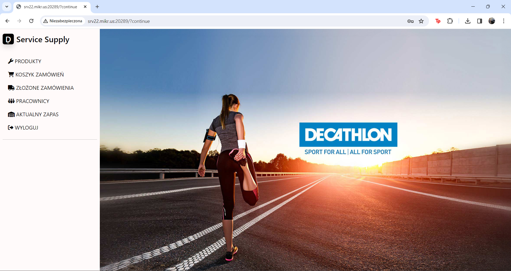

Products list:

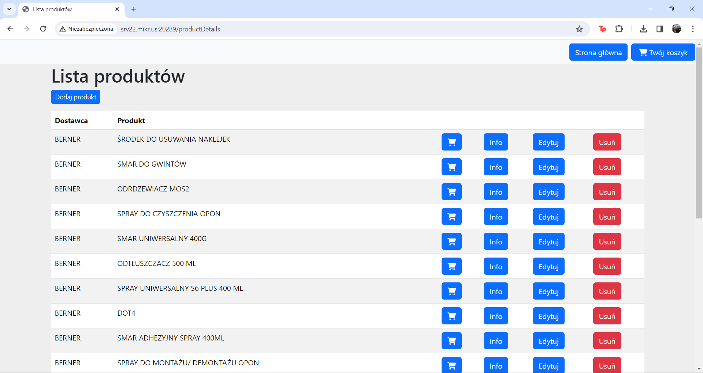

Add new product:

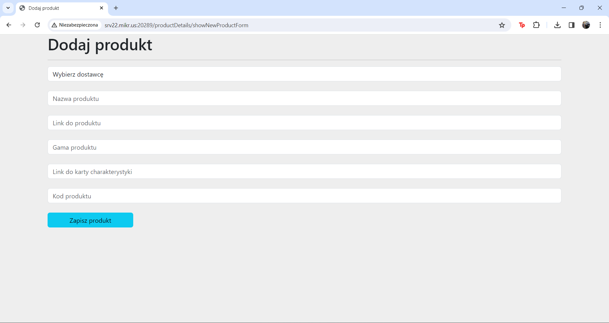

Dropdown list:


Validation:

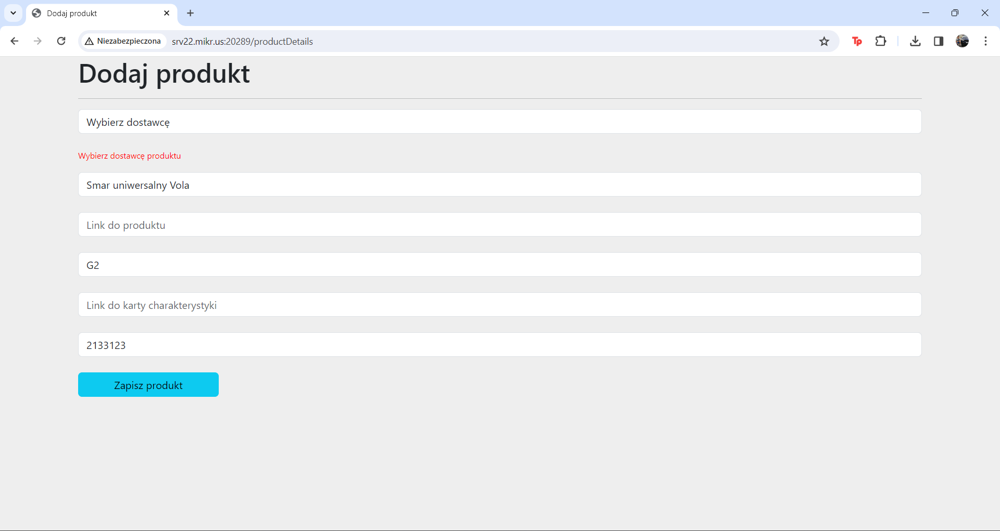

Product info:

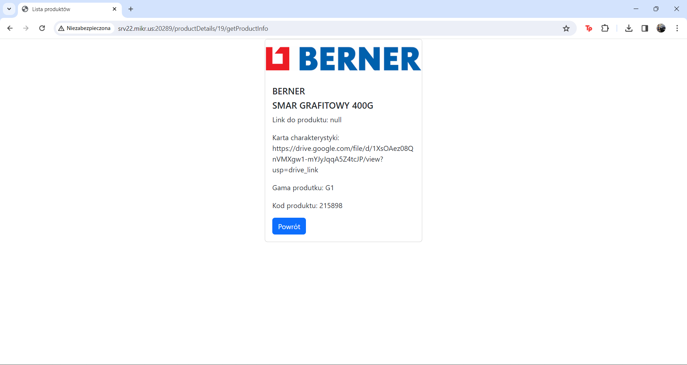

Modify product:

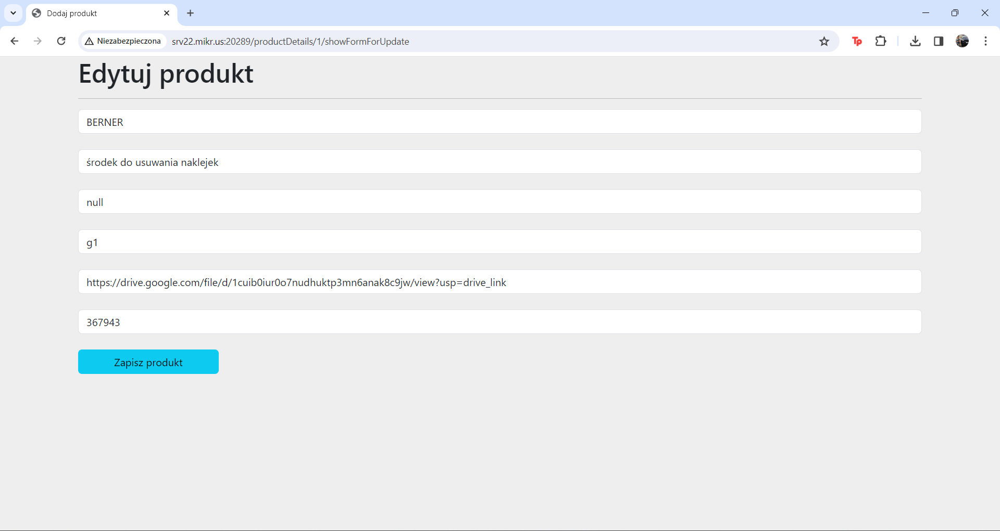

Employees:

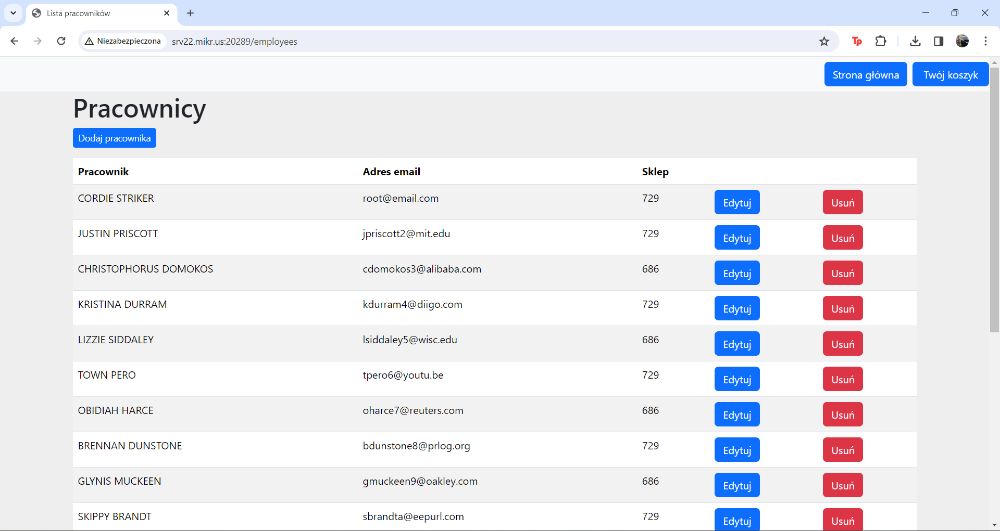

Shopping cart:

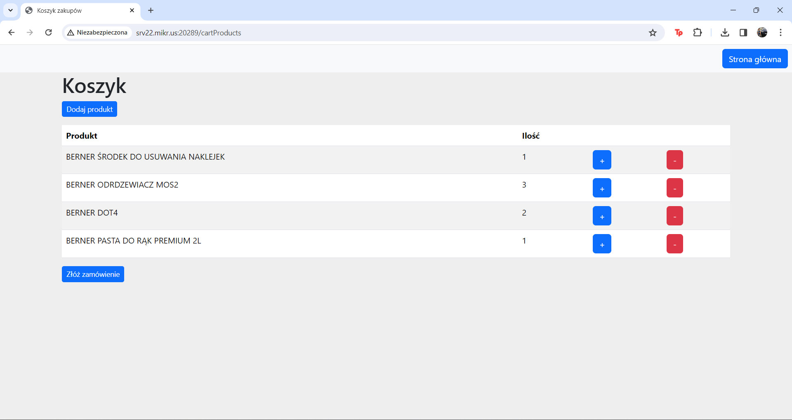

Store products:

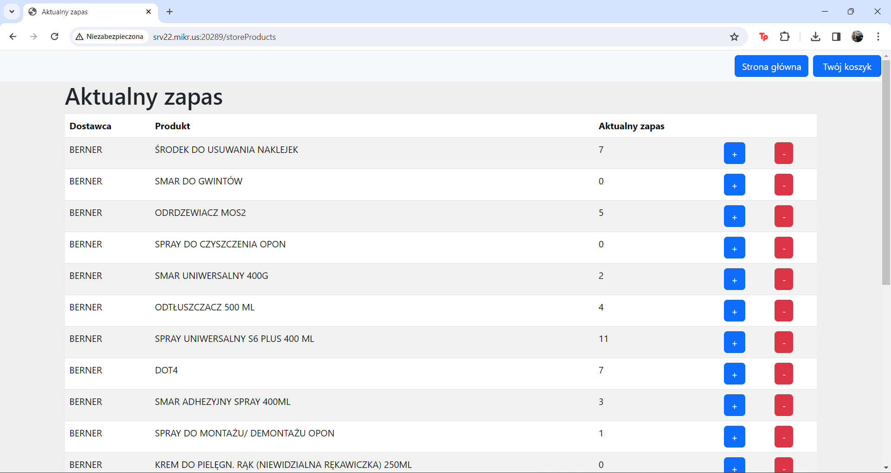

Support error page:

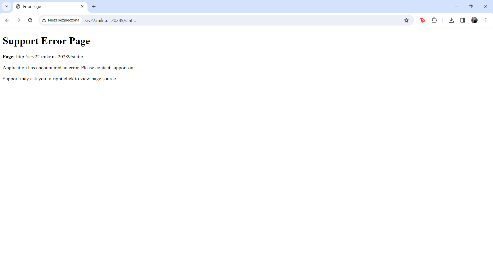

Support error page resource:

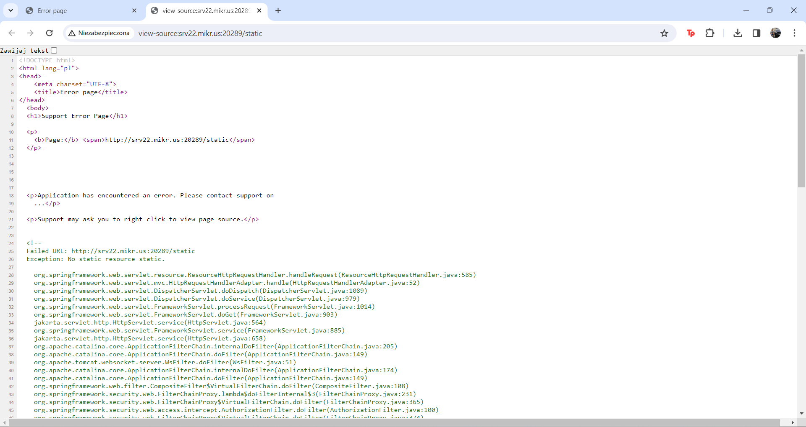


## Design Patterns

Spring Bean is a singleton by default.

## Contact

📫 patryk.kawula1@gmail.com

## License

Distributed under the Mit License. [Check here][license-url] for more information.

[license-url]: https://github.com/LittleYodaa/AutoCare/blob/master/LICENSE
